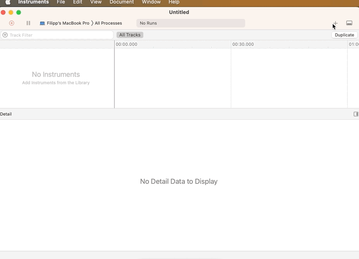

# xctraceprof


JMH profilers based on "xctrace" utility (shipped with XCode Instruments).

The goal of the project is to extend and stabilize profiler features, and then, hopefully, contribute it to JMH.

## Profilers
The library provides two profilers:
- `org.openjdk.jmh.profile.XCTraceAsmProfiler`, a profiler using `xctrace` to sample the process
during benchmark's execution and then annotates hot regions of the assembly.
It's the `perfasm` profiler replacement on macOS.
- `org.openjdk.jmh.profile.XCTraceNormProfiler`, a profiler using `xctrace` to aggregate hardware
performance counters during benchmark's execution.
It's the `perfnorm` profiler replacement on macOS.

Both profilers support `template` parameter specifying XCode Instruments template's name or path to it.
For `XCTraceAsmProfiler` that parameter is optional and `CPU Profiler` will be used by default.

For `XCTraceNormProfiler` that parameter is mandatory.

### Output example
TODO

## Prerequisites
Both profilers require `xctrace` utility available on your device running under macOS.
You can check if it exists by opening a terminal and running the following command:
```bash
xctrace version
```
If the utility is available, then you'll see something like `xctrace version 14.3.1 (14E300c)`. 
Otherwise, you need to install XCode.

## How to use

### Configure a project using JMH framework

Refer to [JMH docs](https://github.com/openjdk/jmh/blob/master/README.md) for details on setting up a project.

### Include library to your project's dependencies

For Gradle-based projects:
```kotlin
dependencies {
    implementation("io.github.fzhinkin:xctraceprof:0.0.2")
}
```

For Maven-based projects:

```xml
<dependencies>
    <dependency>
        <groupId>io.github.fzhinkin</groupId>
        <artifactId>xctraceprof</artifactId>
        <version>0.0.2</version>
    </dependency>
</dependencies>
```

###

### Specify profilers when running JMH benchmarks
```bash
java <jvm args> -jar benchmarks.jar <benchmark options>  -prof 'org.openjdk.jmh.profile.XCTraceAsmProfiler'
java <jvm args> -jar benchmarks.jar <benchmark options>  -prof 'org.openjdk.jmh.profile.XCTraceAsmProfiler:template=Time Profiler'
java <jvm args> -jar benchmarks.jar <benchmark options>  -prof 'org.openjdk.jmh.profile.XCTraceNormProfiler:template=YourTemplate'
```

## Configuring your own template
You can configure your own profiling template in Instruments.
Currently, profilers support only templates that use one of the following instruments:
- `CPU Profiler`
- `Time Profiler`
- `CPU Counters`

There are not so many recording settings for `CPU Profiler` and `Time Profiler`, so you can
use these templates with `XCTraceAsmProfiler` as it is. However, if you want to profile benchmarks
using a hardware performance counter other that cycles count or willing to use `XCTraceNormProfiler` then
you need to configure a template using `CPU Counters` instrument and change recording settings
to sample by particular event, or to sample specific hardware performance counter values. 

Here's a small demo showing how to create a template to sample cycles and instructions on Intel-based MacBook:


## Licence

Distributed under the GNU GPL V2 License. See [LICENSE](LICENSE) for more information.


